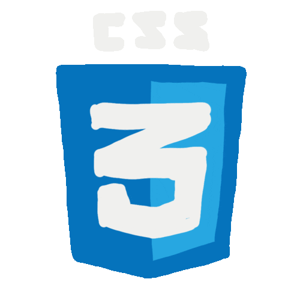
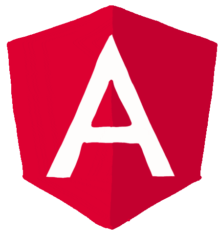
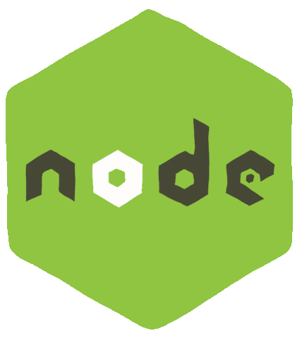

<h1 align="center">Hi there! Thank you for your visit 😁</h1>

  

<h2 align="center">📖 You can find me coding with...</h2>

  
  
  
  
  

  
  
  
  
  

 
<h3>And, of course, with other tools like...</h3>

  
  
  
  
  
  
  
  
  
  
  

 
<h2 align="center">🚀 About me</h2>

I am a full-stack developer with extensive experience building and delivering stable, scalable, and intuitive web apps. I thrive at transforming difficult ideas into elegant and effective solutions since I have a solid foundation in both front-end and back-end technologies.

I have successfully completed a variety of projects during my career, from creating dynamic e-commerce systems to creating engaging and adaptable online applications. I can create visually beautiful and understandable user interfaces that improve the user experience thanks to my in-depth understanding of HTML, CSS, JavaScript, and numerous frameworks.

I am skilled in using a variety of databases and have expertise working with server-side languages like Python and Node.js. I am well-versed in RESTful design and API integration, ensuring smooth communication between the system's many parts.

 
<h2 align="center">✉️ Here you have my social networks</h2>

  
  

